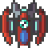
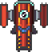
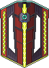

# 🎬 Demonstration

I use WSL so I sometimes experience *freezes*, which is not the case with native Linux.  


# [EN] Xenon2-Megablast

This project is a *space-shooter* of the *shoot'em up* type, inspired by the game [Xenon 2: Megablast](https://en.wikipedia.org/wiki/Xenon_2:_Megablast).  

The report is available [here](Rapport_projet_PAF_VADIMON.pdf) (in french).  

## User Manual

### Launch

**For the game**, at the project root :
```haskell
stack run
```

**For the tests**, at the project root :
- All unit tests + QuickCheck (407):
```haskell
stack test
```
- A subset of tests, for example :
```haskell
stack test --test-arguments="-m [Game]"
```
where Game can be replaced by : Keyboard, Hitbox, Objects, Assets, Background, Explosion, Rock, Wall, Projectile, Player, Enemy, Bonus  

### Home Screen

The user can, depending on the keys :  
- Press **W / S**, or the **UP / DOWN** arrow keys, to select the "1 Player" or "2 Players" option.  
- Press **SPACE or ENTER** to launch the game with the selected option.  
- Press **ESC** to close the game.  

### In Game

Player 1 is in blue, player 2 in green :  
- Pressing **W / A / S / D** moves player 1's ship in the desired direction, and **SPACE** allows them to shoot forward.  
- Pressing the **UP / LEFT / DOWN / RIGHT** arrow keys moves player 2's ship in the desired direction, and **ENTER** allows them to shoot forward.  
- Pressing **ESC** returns to the home screen.  

## Gameplay

Periodically and randomly, waves of enemies and floating walls appear in front of the players.  
The goal is to eliminate as many enemies as possible to achieve the highest score.  

Each player has **3 lives**, each with **100 health points**, and loses them upon collision with an enemy or one of their projectiles. Movements are restricted to the screen, and collisions with walls or between players are handled.  

When a player loses a life (without it being their last), they gain a **2-second invincibility period**, during which they blink in white. When a player loses their last life, they can no longer interact with the game.  
When all players are dead, the game continues : pressing **ESC** returns to the home screen to start a new game.  

## Enemies

There are 3 types of enemies, each with unique behavior and characteristics :

| | Description |
|--|-------------|
|  | **NoMoveButBoomEnemy**: scrolls downward following the screen speed.<br>Has 1 health point, deals 20 damage on collision, and is worth **10 points** when eliminated. |
|  | **LeftRightShootEnemy**: descends to a random position, then moves left and right while shooting every second.<br>Has 1 health point, deals 10 damage (collision or projectile), and is worth **25 points** when eliminated. |
|  | **LoopEnemy**: descends to a random position, performs a full spiral, then continues downward at high speed.<br>Has 3 health points and deals 10 damage per remaining health point on collision (up to 30). Worth **50 points** when eliminated. |

## Bonuses

Each time an enemy is killed by a projectile, there is a **10% chance** that a bonus appears at its location.
There are 4 collectible bonuses :  

| | Effect |
|--|--------|
|  | **Enlargement** of the shot size. |
|  | **Division by 3 of the delay** between shots. |
|  | **Triple damage** per shot. |
|  | **Triple the speed** of the shot. |

Bonuses are not stackable : picking one up replaces the previous one.  

## Main Features

- **1 or 2 player** simultaneous mode.  
- **Unlimited procedural generation** of enemy waves and walls.  
- **Lives and temporary invincibility** system.  
- **Random bonus system** modifying shots.  

# [FR] Xenon2-Megablast

Ce projet consiste en un *space-shooter* de type *shoot'em up*, inspiré du jeu [Xenon 2: Megablast](https://fr.wikipedia.org/wiki/Xenon_2:_Megablast).  

Le rapport est [ici](Rapport_projet_PAF_VADIMON.pdf).  

## Manuel d'utilisation

### Lancement

**Pour le jeu**, à la racine du projet :demo
```haskell
stack run
```

**Pour les tests**, à la racine du projet :
- L'intégralité des tests unitaires + QuickCheck (407) :
```haskell
stack test
```
- Un sous-ensemble des tests, par exemple :
```haskell
stack test --test-arguments="-m [Game]"
```
où Game peut être remplacé par : Keyboard, Hitbox, Objects, Assets, Background, Explosion, Rock, Wall, Projectile, Player, Enemy, Bonus  

### Écran d'accueil

L’utilisateur peut selon les touches :  
- Appuyer sur **Z / S**, ou sur les flèches **HAUT / BAS**, pour sélectionner l’option “1 Player” ou “2 Players”.  
- Appuyer sur la touche **ESPACE ou ENTRÉE** pour lancer le jeu avec l’option sélectionnée.  
- Appuyer sur la touche **ECHAP** pour fermer le jeu.  

### En jeu

Le joueur 1 est en bleu, le joueur 2 en vert :
- Appuyer sur les touches **Z / Q / S / D** permet au vaisseau du joueur 1 de se déplacer dans la direction souhaitée, et **ESPACE** lui permet de tirer devant lui.
- Appuyer sur les flèches **HAUT / GAUCHE / BAS / DROITE** permet au vaisseau du joueur 2, de se déplacer dans la direction souhaitée, et **ENTRÉE** lui permet de tirer devant lui.
- Appuyer sur la touche **ECHAP** permet de revenir à l’écran d’accueil.

## Déroulement du jeu

De manière périodique et aléatoire, des vagues d'ennemis et des murs flottants apparaissent devant les joueurs.  
Le but est d'éliminer le plus possible d'ennemis afin d'amasser le score le plus élevé.  

Chaque joueur possède **3 vies**, chacune ayant **100 points de vie**, et en perd à chaque collision avec un adversaire ou avec un de ses projectiles. Les mouvements sont restreints à l'écran, et les collisions avec les murs ou entre joueurs sont gérées.  

Lorsqu'un joueur perd une vie (sans que ce soit la dernière), il bénéficie d'une **période d'invincibilité de 2 secondes**, durant laquelle il clignote en blanc. Lorsqu'un joueur perd sa dernière vie, il ne peut plus interagir avec le jeu.  
Lorsque tous les joueurs sont morts, le jeu continue : appuyer sur **ECHAP** permet de revenir à l'écran d'accueil et de relancer une partie.  

## Ennemis

Il existe 3 types d'ennemis, chacun avec un comportement et des caractéristiques uniques :

| | Description |
|--|-------------|
|  | **NoMoveButBoomEnemy** : défile vers le bas en suivant la vitesse de l'écran.<br>Possède 1 point de vie, inflige 20 points de dégâts en cas de collision, et vaut **10 points** à l'élimination. |
|  | **LeftRightShootEnemy** : descend vers une ordonnée aléatoire, puis se déplace de gauche à droite en tirant chaque seconde.<br>Possède 1 point de vie, inflige 10 points de dégâts (collision ou projectile), et vaut **25 points** à l'élimination. |
|  | **LoopEnemy** : descend vers une ordonnée aléatoire, effectue une spirale complète, puis continue vers le bas à vitesse élevée.<br>Possède 3 points de vie et inflige en cas de collision 10 points de dégâts par point de vie restant (jusqu'à 30 points). Vaut **50 points** à l'élimination. |

## Bonus

À chaque mort d'un ennemi tué par un projectile, il y a **10% de chances** qu'un bonus apparaisse à son emplacement.
Il existe 4 bonus ramassables :

| | Effet |
|--|-------|
|  | **Agrandissement** de la taille du tir. |
|  | **Division par 3 du délai** entre chaque tir. |
|  | **Triplement des dégâts** du tir. |
|  | **Triplement de la vitesse** du tir. |

Les bonus ne sont pas cumulables : en ramasser un remplace le précédent.  

## Principales fonctionnalités

- **Mode 1 ou 2 joueurs** simultané.  
- **Génération procédurale** illimitée de vagues d'ennemis et de murs.  
- **Système de vies et d'invincibilité** temporaire.  
- **Système de bonus** aléatoires modifiant les tirs.  